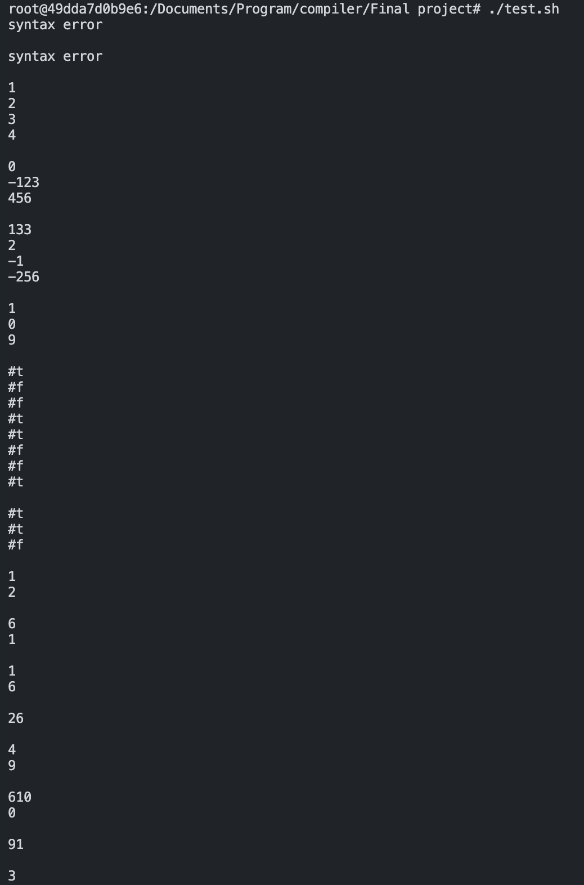

# Mini-Lisp Final Project

## Implementation

Create an **AST**(Abstract syntax tree) while yacc does parsing, then traverse the AST in postorder.

### Values

Re-define `YYSTYPE` to a pointer of self-defined struct `Node`, a later built AST Node structure.

It contains the [Node Type](#node-type) of the node, left and right child.

And in this implementation, **we treat `int` and `bool` as int**. But string is still separated.

### If statement

Node `If statement` has three child node, (i.e., left(THEN-EXP), right(ELSE-EXP), cond(TEST-EXP)).

When Node `If statement` is matched, traverse cond, and based on the conditional boolean value, decide take left or right as this Node `If statement`'s value.

### Function

Only implements inline function and named function.

For parameter evaluation, treat `params_name` and `params_value` as linked list inserted in the left of Node `func_call` and `func`.

Then, set 2 pointers in the beginning of 2 linked list, start matching `params_name` with `params_value`. Save the matched name-value pair into `unordered_map` as local variables(**stack frame**), and push them into the function's call stack.

When executed, traverse Node `func` again. This time you have all variables needed, so evaluate the value, and store them on Node `func` and Node `func_call`.

## Node Type

**values:**

- "d": integer number
- "b": boolean value
- "s": string

**result in number:**

- "+"
- "-"
- "\*"
- "/"
- "%": mod

**result in boolean:**

- ">": greater
- "<": smaller
- "=": equal
- "&": and
- "|": or
- "!": not

**result in string:**

- "var": variable

**others:**

- "pn": print-num

  預設讓右節點為 NULL

- "pb": print-bool

- "non_t": non terminal node

**if statement:**

- "if": if statement

**functions:**

- "func": function definition
- "func_call": function calling

## Reference

https://blog.csdn.net/huyansoft/article/details/8860224
https://github.com/Zane2453/Mini-LISP-interpreter_Lex-Yacc

## Result

